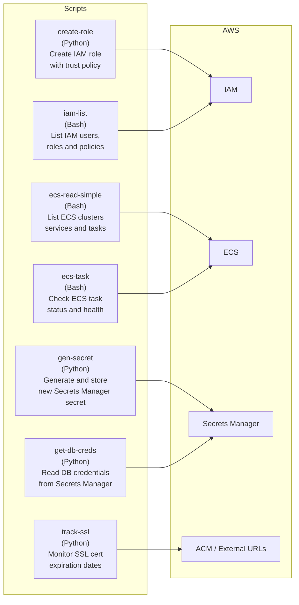

# AWS Automation Scripts

A collection of operational Python and Bash scripts for AWS account automation, ECS deployment checks, Secrets Manager reads, SSL certificate monitoring, IAM inspection, and role creation workflows.

## Architecture



## Scripts

| Script | Language | Description |
|--------|----------|-------------|
| `create-role/` | Python | Creates an IAM role with a custom trust policy and optional permissions boundary |
| `ecs-read-simple/` | Bash | Lists ECS clusters, services, and running tasks across a region |
| `ecs-task/` | Bash | Checks ECS task status and reports on deployment health |
| `gen-secret/` | Python | Generates a random secret and stores it in AWS Secrets Manager |
| `get-db-creds/` | Python | Reads database credentials from Secrets Manager and outputs them for shell use |
| `iam-list/` | Bash | Lists IAM users, roles, groups, and attached policies |
| `track-ssl/` | Python | Monitors SSL certificate expiration for a list of domains and raises alerts |

## Prerequisites

- [AWS CLI](https://docs.aws.amazon.com/cli/latest/userguide/getting-started-install.html) configured
- Python 3.x with `boto3` (install via `pip install -r requirements.txt` in each script folder)
- IAM permissions appropriate to each script's target service

## Getting Started

```shell
git clone https://github.com/hf-monteiro/aws-scripts.git
cd aws-scripts/<script-name>
pip install -r requirements.txt   # for Python scripts
```

Each script folder contains its own `README.md` with specific usage instructions and examples.
